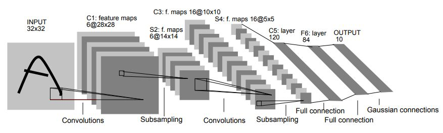
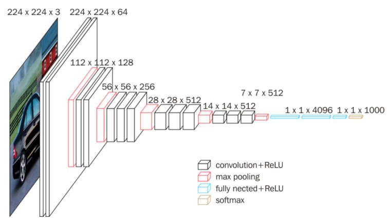

# **Traffic Sign Recognition** 

## Udacity Self Driving Car Engineer Nanodegree - Project 3

**Build a Traffic Sign Recognition Project**

The goals / steps of this project are the following:
* Load the data set (see below for links to the project data set)
* Explore, summarize and visualize the data set
* Design, train and test a model architecture
* Use the model to make predictions on new images
* Analyze the softmax probabilities of the new images
* Summarize the results with a written report

[//]: # (Image References)

[class_labels]: ./examples/class_labels.png "class_labels"
[class_distribution_1]: ./examples/class_distribution_1.png "class_distribution_1"
[class_distribution_2]: ./examples/class_distribution_2.png "class_distribution_2"
[train_dataset]: ./examples/train_dataset.png "train_dataset"
[train_dataset_grayscaled]: ./examples/train_dataset_grayscaled.png "train_dataset_grayscaled"
[train_dataset_equalized]: ./examples/train_dataset_equalized.png "train_dataset_equalized"
[train_dataset_augmented]: ./examples/train_dataset_augmented.png "train_dataset_augmented"
[test_images]: ./examples/test_images.png "test_images"
[test_images_predictions]: ./examples/test_images_predictions.png "test_images_predictions"
[top-5-predictions]: ./examples/top-5-predictions.png "top-5-predictions"
[activation_map_visualization]: ./examples/activation_map_visualization.png "activation_map_visualization"
[vggnet_training_history]: ./examples/training-loss-and-accuracy_vggnet_rmsprop.png "vggnet_training_history"
[confusion_matrix]: ./examples/confusion_matrix.png "confusion_matrix"

## Rubric Points
### Here I will consider the [rubric points](https://review.udacity.com/#!/rubrics/481/view) individually and describe how I addressed each point in my implementation.  

#### Files submitted:
* [README.md](README.md) You’re reading it!
* The [jupyter notebook](Traffic_Sign_Classifier.ipynb) with code
* [HTML output](Traffic_Sign_Classifier.html) of the code
---
### Writeup / README

### Data Set Summary & Exploration

I used the numpy library to calculate summary statistics of the traffic
signs data set:

* The size of training set is 34799
* The size of the validation set is 4410
* The size of test set is 12630
* The shape of a traffic sign image is (32, 32, 3)
* The number of unique classes/labels in the data set is 43

I used the csv library to load the traffic sign names from `signnames.csv`. The names will be needed later to display the descriptive names of the traffic signs instead of the class IDs.

![alt text][class_labels]

#### 2. Include an exploratory visualization of the dataset.

First, I examined how often each class is represented in the dataset. The easiest way is to use a histogram of the number of images in each unique class.

![alt text][class_distribution_1]

If the classes in the dataset are represented very differently, the classes that are represented more frequently are preferred in the classification. However, this should be avoided, therefore each class in the training data set should be represented by an approximately equal number of images.

The histogram above shows that classes are very differently represented, which adversely affects predictive accuracy. Normally, it would be better to supplement the weakly represented classes with more pictures until the number of pictures per class is about the same. But for that we would need a lot more pictures of traffic signs. Therefore I decided to cut the items per class of the training dataset at the median number of images per class.

The distribution is still not optimal, but much better than before. Unfortunately, some classes are very poorly represented, but it makes no sense to use even fewer images because as a rule of thumb you should have at least 1000 images per class to get a good trainig result.

I trained and tested the network once with and once without adjusting the number of pictures. Although I achieved better training and validation results without the adjustment, the network worked better with the adjustment during the test.

![alt text][class_distribution_2]

Next, let's look at the pictures of the dataset. The following diagram shows ten randomly selected images of each class in the training dataset.

![alt text][train_dataset]

### Design and Test a Model Architecture

#### Image Preprocessing

In this step I tested some preprocessing techniques like grayscaling and local histogram equalization.

I trained and tested my network with and without grayscale images respectively local histogram equalization. With grayscale images and histogram equalization, I could achieve better training results, but in the recognition of real images from the Internet I have achieved better results when I use color images. Finally I decided to use color images for this project.

**Grayscaling**

For many classification problems, the colors play little role, just shapes and edges, etc. In these cases, it may be helpful to use grayscale images instead of color images. Especially with large datasets, this speeds up the training process and can also have a positive effect on the achieved accuracy.

The following diagram shows the images of the training dataset as grayscale images.
![alt text][train_dataset_grayscaled]

**Local Histogram Equalization**

This technique simply distributes the most common intensity values in an image, improving low-contrast images. 
![alt text][train_dataset_equalized]

#### Image Augmentation

Image augmentation is a great technique for artificially propagating images of a dataset by duplicating existing images through random manipulations such as scaling, rotation, tilt, noise, ect.

This can be done either by hand by building an augmentation pipeline, analogous to a preprocessing pipeline, which makes the appropriate manipulations. For example, OpenCV offers numerous functions for image manipulation.

But I prefer to use ready-made libraries like `imgaug` or ` augmentor`. Here the augmentation pipeline will be described declaratively, which is very clear. For this project I use `augmentor`, see https://augmentor.readthedocs.io/en/master/. The augmentor delivers already normalized images, so that the normalization by the image preprocessing is dropped.

I used the following methods in my augmentation pipeline:

* Zoom: I use random zoom between factor 0.8 and 1.2 to simulate different distances from the camera to the signs. 
* Rotate: I use a random of +/- 15 degree rotation to simulate signs that appear slightly rotated.
* Skew: I use a random horizontal respectively vertical tilt to simulate different camera perspectives on traffic signs.

The final augmentation pipeline delivers images like these:
![alt text][train_dataset_augmented]

#### 2. Describe what your final model architecture looks like including model type, layers, layer sizes, connectivity, etc.) Consider including a diagram and/or table describing the final model.

Goal of the project is to design and train a model that achieves an accuracy of 93% or greater, on the validation set. In this step, I designed and tested a model architecture to achieve this goal.

Why do I use Keras?

[Keras](https://keras.io/) encapsulates some popular deep learning frameworks, such as [TensorFlow](https://github.com/tensorflow/tensorflow), [CNTK](https://github.com/Microsoft/cntk), or [Theano](https://github.com/Theano/Theano), in a single, streamlined and easy-to-understand API. In my opinion, network architectures and training processes in Keras are much easier to understand, because the Keras API is limited to the essentials and uses a strongly declarative approach. In addition, Keras makes it easy to switch between the different deep learning frameworks without much code customization.

Since I'm already familiar with Keras and because I love Keras' streamlined API, I've decided to use Keras for the project. But notice, that I use TensorFlow as backend under the hood!

First, I tried the LeNet-5 architecture that was used in the classroom examples.

LeNet-5 is a convolutional network designed for handwritten and machine-printed character recognition. It was introduced by the [Yann LeCun](https://en.wikipedia.org/wiki/Yann_LeCun) in his paper [Gradient-Based Learning Applied to Document Recognition](http://yann.lecun.com/exdb/publis/pdf/lecun-01a.pdf) in 1998. We can also use the LeNet architecture to classify traffic signs.

LeNet Architecture:

With the LeNet-5 architecture I got a value accuracy of 91.25% and test accuracy of 88.84%. However, this result is below the requirement!

In order to improve the weak result obtained with the LeNet model, I use a variant of the VGGNet architecture from the book [Deep Learning for Computer Vision](https://www.pyimagesearch.com/deep-learning-computer-vision-python-book/) of [Adrian Rosebrock](https://www.pyimagesearch.com/author/adrian/), called MiniVGGNet. This follows the same architectural pattern as the origial VGGNet architecture, but has significantly fewer layers.

The VGG network architecture was introduced by Simonyan and Zisserman in their 2014 paper, [Very Deep Convolutional Networks for Large Scale Image Recognition](https://arxiv.org/abs/1409.1556). It is one of the highest performing Convolutional Neural Networks on the [ImageNet challenge](http://image-net.org/challenges/LSVRC/) over the past few years.

VGGNet Architecture:

This network is characterized by its simplicity, using only 3×3 convolutional layers stacked on top of each other in increasing depth. Reducing volume size is handled by max pooling. Two fully-connected layers, each with 4,096 nodes are then followed by a softmax classifier.

Finally, I use the MiniVGGNet model, which consisted of the following layers:

| Layer         		|     Description	        		                			| 
|:---------------------:|:-------------------------------------------------------------:| 
| Input         		| 32x32x3 RGB image   						                	| 
| Convolution 3x3     	| 32 3x3 filters, 1x1 stride, same padding, outputs 32x32x32 	|
| RELU					| outputs 32x32x32							                    |
| Batch normalization 	| outputs 32x32x32              	                			|
| Convolution 3x3     	| 32 3x3 filters, 1x1 stride, same padding, outputs 32x32x32 	|
| RELU					| outputs 32x32x32							                    |
| Batch normalization 	| outputs 32x32x32                 	                			|
| Max pooling	      	| 2x2 stride, outputs 16x16x32				                    |
| Dropout				| 0.25, outputs 16x16x32	        		                    |
| Convolution 3x3     	| 64 3x3 filters, 1x1 stride, same padding, outputs 16x16x64 	|
| RELU					| outputs 16x16x64							                    |
| Batch normalization 	| outputs 16x16x64                 	                			|
| Convolution 3x3     	| 64 3x3 filters, 1x1 stride, same padding, outputs 16x16x64 	|
| RELU					| outputs 16x16x64   						                    |
| Batch normalization 	| outputs 16x16x64                 	                			|
| Max pooling	      	| 2x2 stride, outputs 8x8x64				                    |
| Dropout				| 0.25, outputs 8x8x64						                    |
| Fully connected		| outputs 512               									|
| RELU					| outputs 512  			       				                    |
| Batch normalization 	| outputs 512               	                    			|
| Dropout				| 0.5, outputs 512									            |
| Fully connected		| outputs 43                									|
| Softmax				| outputs 43                									|

#### 3. Describe how you trained your model. The discussion can include the type of optimizer, the batch size, number of epochs and any hyperparameters such as learning rate.

**Hyperparameter**

I tried the three optimization methods `sdg`, `adam` and `rmsprop`. With `rmsprop` I got significant better results than with the others, so I finally use the `rmsprop` optimization method.
I also use a batch_size of 256 and a number of 100 epochs.

To control the training process I use the following 3 Keras callback methods:

* EarlyStopping: Stops the training process prematurely if no improvement has been achieved for several consecutive epochs.

* ModelCheckpoint:
Saves the best model ever learned after each epoch.

* ReduceLROnPlateau:
Automatically reduces the learning rate if no improvement has been achieved over several epochs. The initial lerning rate starts by 0.001.

My final model results were:
* training set accuracy of 99.66%
* validation set accuracy of 97.30%
* test set accuracy of 94.66%

**Training History**

![alt text][vggnet_training_history]

**Confusion Matrix**

A confusion matrix is a summary of prediction results on a classification problem.

The number of correct and incorrect predictions are summarized with count values and broken down by each class. The confusion matrix shows in which cases the classification model is confused when it makes predictions.

Here is the confusion matrix of the trained MiniVGGNet model calculated with the test data. The confusion matrix shows that the model has very few outliers.
![alt text][confusion_matrix]

### Test the Model on New Images

Here are 20 German traffic signs that I found on the web:

![alt text][test_images]

And here are the results of the prediction:

![alt text][test_images_predictions]

The model was able to correctly guess 19 of the 20 traffic signs, which gives an accuracy of 95%. This compares favorably to the accuracy on the test set of 94.66%.

It is noticeable that the misrecognized image should have class 23 (Slippery road). This is one of the classes underrepresented in the training data, so this class is disadvantaged in the classification!!

Top 5 softmax probabilities for each image along with the sign type of each probability:

![alt text][top-5-predictions]

The diagram above shows that most classes are clearly recognized. Only in "Speed limit (100km/h)" the top 5 predictions are close together. But that is also because the dataset contains  of several classes that are very similar.

### (Optional) Visualizing the Neural Network

To get a better understanding of how the network sees an image and which features lead to classification, it is useful to visualize the activation maps of the various network layers. The following example visualizes the activation maps for one of the test images. 

![alt text][activation_map_visualization]

## Conclusion

With a test accuracy of 94.66%, I have achieved a decent result, but for use in real life, this is not enough. To further improve accuracy, the following steps can be taken:

* Improving the Data Set: 
The data set used is not optimal. On the one hand, the number of images per class varies greatly, on the other hand, there are too few images for some classes. This should be corrected urgently. Using a dataset that reflects the real problem is probably the most important factor in successfully building a deep learning model!  
* Image Augmentation: 
The image augmentation can also be further improved to better meet the real life conditions. For example, we can simulate horizontal and vertical shifts, partially truncated traffic signs, or picture interference.  
* Test futher Network Architectures: 
We can examine other network architectures such as ResNet, Inception or Exception.  
* Tunig Hyperparameters: 
The accuracy can also be improved by further tuning the hyperparameters. For this, techniques such as ensembles or cross-validation can be used.

However, I think this will not be enough for use on autonomous vehicles. The problem is that with the current solution, we can always assign only one label to a picture, and that the object to be recognized in each case must fill the pictures fairly. However, the camera of a vehicle recognizes the entire environment. One picture can contain many interesting objects such as traffic signs, pedestrians or other vehicles. These can occur multiple times at different positions in the image and scale strongly through the different distances. A simple classification is not sufficient here, we must be able to recognize different objects in a picture and also to locate them, even if objects of a class exist several times. For this we can investigate networks such as SSD, Faster R-CNN or YOLO.
